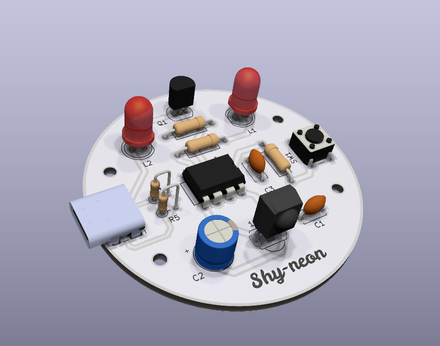
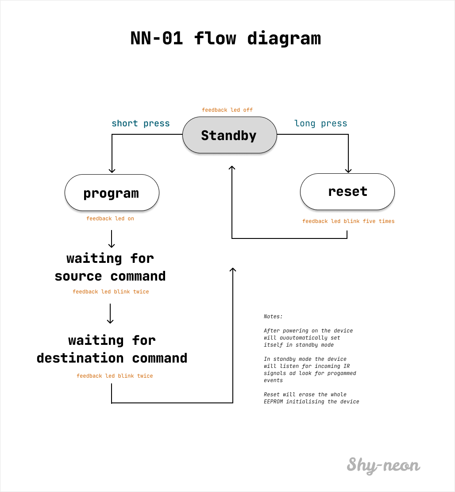

# NN-01
IR interpreter based on attiny-85

<b>THIS PROJECT IS NOT COMPLETE YET! </b>   this repository is in pre release, and its purpose is just to show the project status! For free updates, see my <a href="https://patreon.com/Favtool?utm_medium=unknown&utm_source=join_link&utm_campaign=creatorshare_creator&utm_content=copyLink">patreon</a> page

